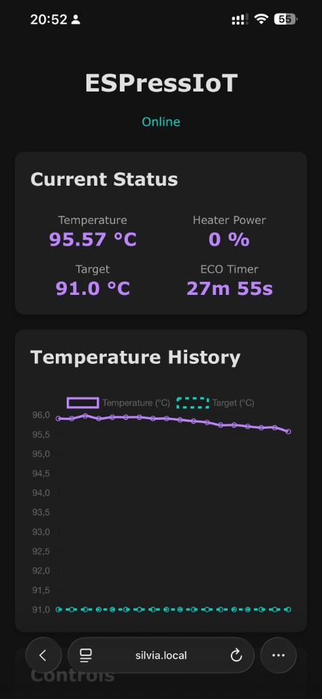
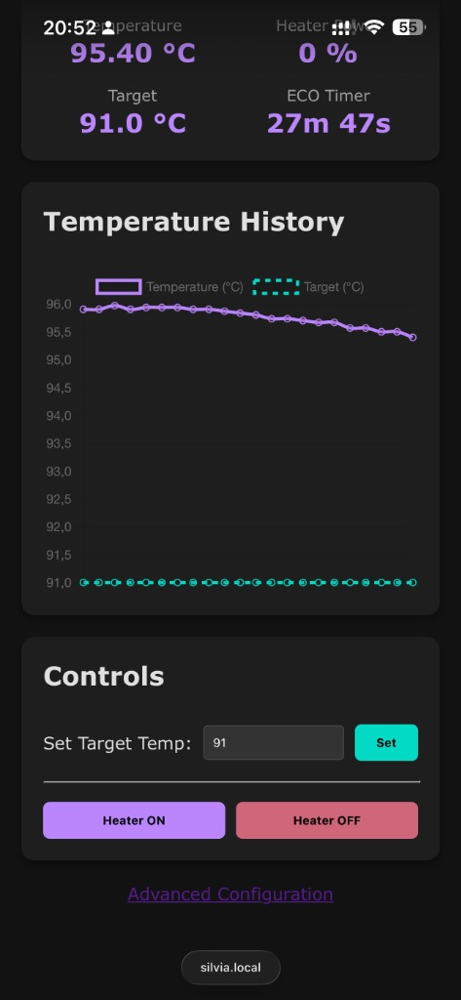
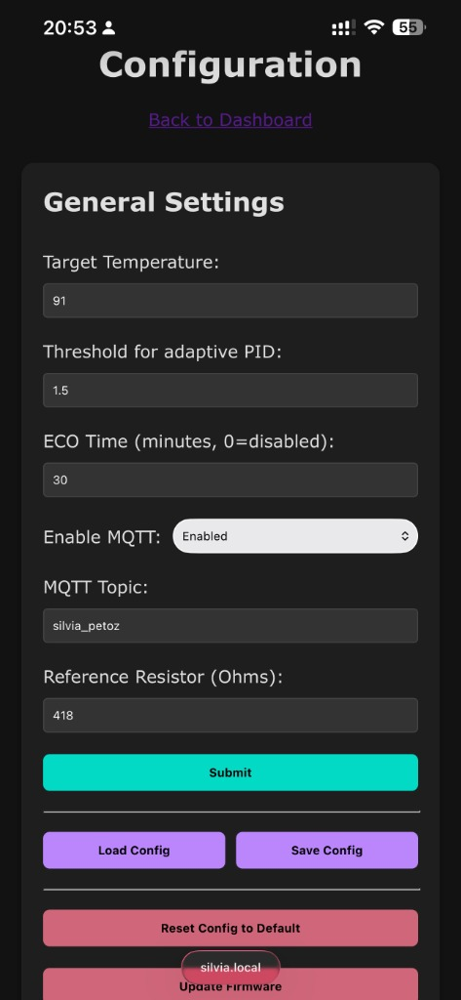
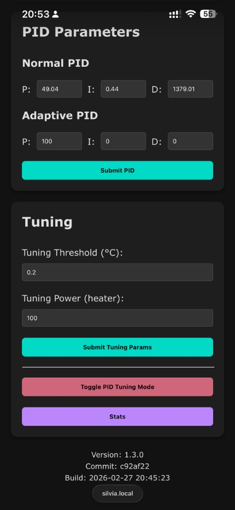
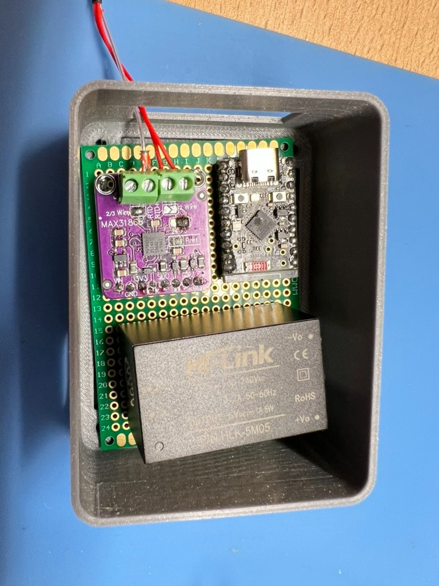
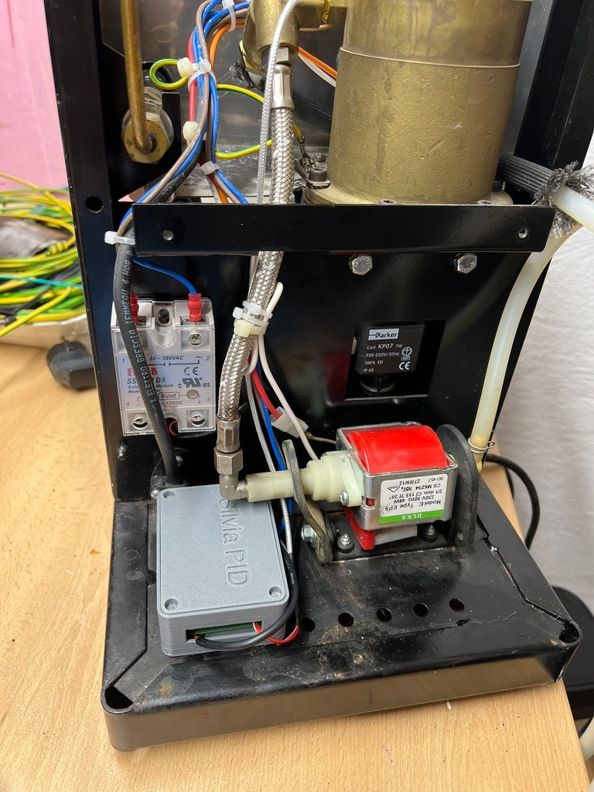
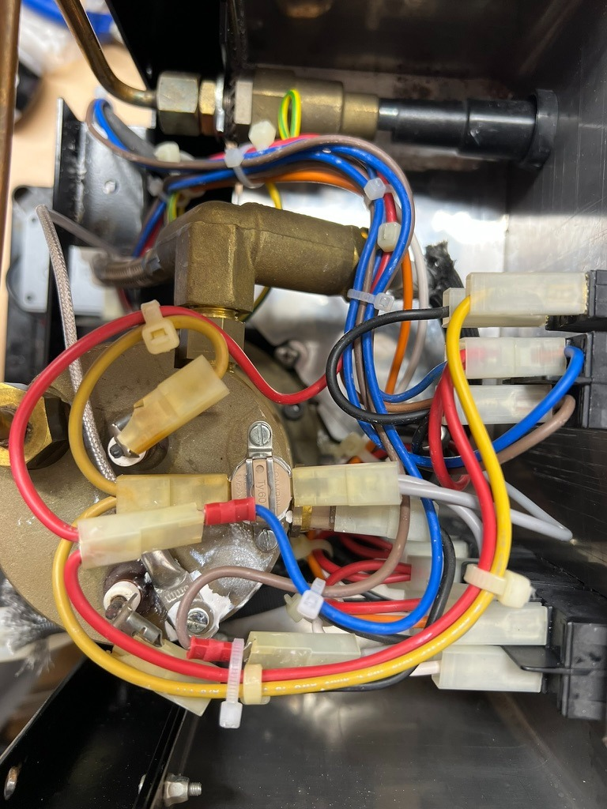

# ESPressIoT
This project covers somewhat advances features for an espresso machine controller. The basic idea was to have reproducible "espresso results" due to temperature regulation and being able to fine-tune. Especialy small machines have a low heat capacity and quality suffers a lot from different heat-up-times and high hysteresis in standard temperature switches.
This work is based on my previous work with with IoT, MQTT and my small controller [cofcon](https://github.com/Schm1tz1/cofcon). It is also heavily based on the original [ESPressIoT](https://github.com/Schm1tz1/ESPressIoT) project by Schm1tz1. As always - take care, you are working with high voltages and you are switching loads up to a few Kilowatts. Please be sure yo know what you are doing, always disconnect and unplug you machine before installing electronics components, choose your components (cables, connectors, sensors, SSR etc.) wisely...

## Dependencies
* Espresso Machine (Gaggic CC, Rancilio Silvia etc.)
* ESP8266 with [Arduino for ESP8266][1]
* [ArduinoJSON v6][5]
* [Arduino-PID-Library v1][2] 
* [ArduinoStreamUtils][6]
* a suitable temperature sensor (e.g. TSIC 306 - [library here][3])
* a SSR which is capable of switching your heater, has a low trigger threshold and does not draw too much current (otherwise you will toast your ESP8266)
* some electronics skills

## Features
* very fast and accurate adaptive PID-Controller for the heater of your espresso machine (heat-up-time about 2 minutes, stability/RMS of ~0.15 °C)
* WWW-Interface for control, configuration and tuning
* Telnet-Server for PID status (analogous to serial terminal)
* MQTT-Interface (needs [PubSub-Client][4])
* OTA-Flash enabled (over-the-air, flash firmware via upload in WWW-Interface)
* Serial Interface for testing, debugging
* JSON-Config in internal SPIFFS (uses [ArduinoJSON][5])
* Re-Written auto-tuning-loop to optimize PID parameters
* integrated simulation to test features and functionality
* Configurable MQTT settings via Web UI (Enable/Disable, Custom Topic Prefix)
* Automated Versioning: Web UI displays current Firmware Version, Git Commit, and Build Timestamp
* ECO Timer: Auto-off feature to turn off the heater after a configurable period of inactivity

## Local Development
To test and modify the web interface (HTML/SCSS/JS) locally without flashing the ESP32:

1. Ensure you have Python 3 and Ruby Sass installed.
2. In one terminal, start the local mock server:
   ```bash
   python3 serve_mock.py
   ```
3. In another terminal, watch for SCSS changes:
   ```bash
   sass --watch web/style.scss:web/style.css
   ```
4. Open your browser to `http://localhost:8000`.
   *(Tip: Ensure your browser restricts caching (e.g., Hard Refresh) to immediately see CSS changes).*

## Screenshots

<p float="left">
  
   
</p>
<p float="left">
  
  
</p>

## Hardware Installation
<p float="left">
  
  
  
</p>

[1]: https://github.com/esp8266/Arduino
[2]: https://github.com/br3ttb/Arduino-PID-Library
[3]: https://github.com/Schm1tz1/arduino-tsic
[4]: https://github.com/knolleary/pubsubclient
[5]: https://github.com/bblanchon/ArduinoJson
[6]: https://github.com/bblanchon/ArduinoStreamUtils/

